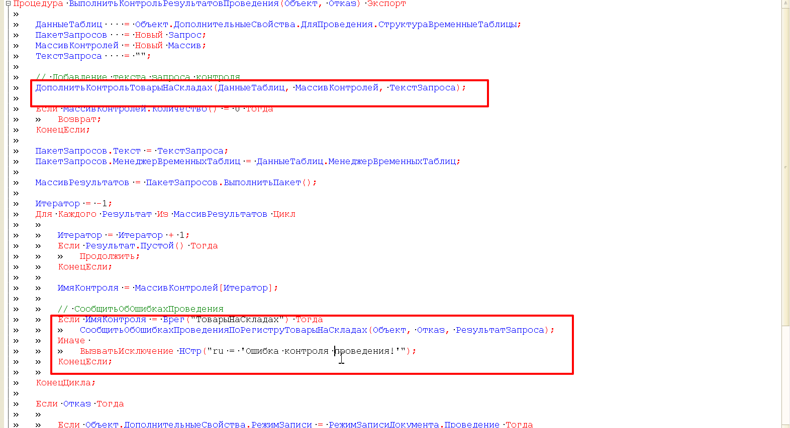

Общий модуль **рздПроведениеСервер** позволяет реализовать классический подход проведения (до появления учетных механизмов) в документах.

[Описание данной схемы проведения.](https://xn----1-bedvffifm4g.xn--p1ai/articles/2017-09-07-documents-posting-scheme/)

<details>
  <summary>Пример события **ПередЗаписью**:</summary>

```
Процедура ПередЗаписью(Отказ, РежимЗаписи, РежимПроведения)
	
	Если ОбменДанными.Загрузка Тогда
		Возврат;
	КонецЕсли;
	
	рздПроведениеСервер.ПередЗаписьюДокумента(ЭтотОбъект, РежимЗаписи);
	
КонецПроцедуры
```
</details>

<details>
  <summary>Пример события **ОбработкаПроведения:**</summary>

```
Процедура ОбработкаПроведения(Отказ, РежимПроведения)
	
	рздПроведениеСервер.ИнициализироватьДополнительныеСвойстваДляПроведения(Ссылка, ДополнительныеСвойства, РежимПроведения);
	
	Документы.ИмяДокумента.ИнициализироватьДанныеДокумента(Ссылка, ДополнительныеСвойства);
	
	рздПроведениеСервер.ПодготовитьНаборыЗаписейКРегистрацииДвижений(ЭтотОбъект);
	
	рздПроведениеСервер.ЗагрузитьТаблицыДвижений(ДополнительныеСвойства, Движения);
	
	СформироватьСписокРегистровДляКонтроля();
	
	рздПроведениеСервер.ЗаписатьНаборыЗаписей(ЭтотОбъект);

	рздПроведениеСервер.ВыполнитьКонтрольРезультатовПроведения(ЭтотОбъект, Отказ);
	
	рздПроведениеСервер.ОчиститьДополнительныеСвойстваДляПроведения(ДополнительныеСвойства);
	
КонецПроцедуры

#Область Прочее

Процедура СформироватьСписокРегистровДляКонтроля()

	Массив = Новый Массив;

	Массив.Добавить(Движения.ОбеспечениеЗаказов);

	ДополнительныеСвойства.ДляПроведения.Вставить("РегистрыДляКонтроля", Массив);

КонецПроцедуры

#КонецОбласти
```
</details>

<details>
  <summary>Пример модуля менеджера документа:</summary>

```
Процедура ИнициализироватьДанныеДокумента(ДокументСсылка, ДополнительныеСвойства, Регистры = Неопределено) Экспорт
	
	////////////////////////////////////////////////////////////////////////////
	// Создадим запрос инициализации движений
	
	Запрос = Новый Запрос;
	ЗаполнитьПараметрыИнициализации(Запрос, ДокументСсылка);
	
	////////////////////////////////////////////////////////////////////////////
	// Сформируем текст запроса
	
	ТекстыЗапроса = Новый СписокЗначений;
	// Добавление текстов запроса
	
	рздПроведениеСервер.ИнициализироватьТаблицыДляДвижений(Запрос, ТекстыЗапроса, ДополнительныеСвойства.ТаблицыДляДвижений, Истина);
	
КонецПроцедуры

Процедура ЗаполнитьПараметрыИнициализации(Запрос, ДокументСсылка)
	
	Запрос.МенеджерВременныхТаблиц = Новый МенеджерВременныхТаблиц;
	Запрос.УстановитьПараметр("Ссылка", ДокументСсылка);
	
	Запрос.Текст = 
	"";
	
	Реквизиты = Запрос.Выполнить().Выбрать();
	Реквизиты.Следующий();
	
	Запрос.УстановитьПараметр("Период", Реквизиты.Период);
	
КонецПроцедуры
```
</details>

<details>
  <summary>**Модуль набора записей регистра накопления для контроля остатков**:</summary>

```
#Если Сервер Или ТолстыйКлиентОбычноеПриложение Или ВнешнееСоединение Тогда

#Область ОбработчикиСобытий

Процедура ПередЗаписью(Отказ, Замещение)

	Если ОбменДанными.Загрузка Тогда
		Возврат;
	КонецЕсли;

	ОбновлениеИнформационнойБазы.ПроверитьОбъектОбработан(ЭтотОбъект);

	Если рздПроведениеСервер.РассчитыватьИзменения(ДополнительныеСвойства) Тогда
		
		БлокироватьДляИзменения = Истина;

		СформироватьТаблицуИсходныхДвижений();

	КонецЕсли;

КонецПроцедуры

Процедура ПриЗаписи(Отказ, Замещение)

	Если ОбменДанными.Загрузка Тогда
		Возврат;
	КонецЕсли;

	Если рздПроведениеСервер.РассчитыватьИзменения(ДополнительныеСвойства) Тогда
		СформироватьТаблицуИзмененийДвижений();
	КонецЕсли;

КонецПроцедуры

#КонецОбласти

#Область СлужебныеПроцедурыИФункции

Процедура СформироватьТаблицуИсходныхДвижений()

	// Текущее состояние набора помещается во временную таблицу "ДвиженияПередЗаписью",
	// чтобы при записи получить изменение нового набора относительно текущего.
	Запрос = Новый Запрос;
	Запрос.УстановитьПараметр("Регистратор", Отбор.Регистратор.Значение);
	Запрос.УстановитьПараметр("ЭтоНовый",    ДополнительныеСвойства.ЭтоНовый);
	Запрос.МенеджерВременныхТаблиц = ДополнительныеСвойства.ДляПроведения.СтруктураВременныеТаблицы.МенеджерВременныхТаблиц;

	ТекстЗапроса =
		"ВЫБРАТЬ
		|	Таблица.Номенклатура                                  КАК Номенклатура.
		|	ВЫБОР
		|		КОГДА Таблица.ВидДвижения = ЗНАЧЕНИЕ(ВидДвиженияНакопления.Расход) ТОГДА
		|			-Таблица.ВНаличии
		|		ИНАЧЕ
		|			0
		|	КОНЕЦ                                                 КАК ВНаличииПередЗаписьюРасход
		|
		|ПОМЕСТИТЬ СвободныеОстаткиПередЗаписью
		|ИЗ
		|	РегистрНакопления.СвободныеОстатки КАК Таблица
		|ГДЕ
		|	Таблица.Регистратор = &Регистратор
		|	И НЕ &ЭтоНовый";

	Запрос.Текст = ТекстЗапроса;
	Запрос.Выполнить();

КонецПроцедуры

Процедура СформироватьТаблицуИзмененийДвижений()

	СтруктураВременныеТаблицы = ДополнительныеСвойства.ДляПроведения.СтруктураВременныеТаблицы;
	
	Запрос = Новый Запрос;
	Запрос.УстановитьПараметр("Регистратор", Отбор.Регистратор.Значение);
	Запрос.МенеджерВременныхТаблиц = СтруктураВременныеТаблицы.МенеджерВременныхТаблиц;
	
	//Рассчитывается изменение нового набора относительно текущего с учетом накопленных изменений
	//и помещается во временную таблицу.
	Запрос.Текст =
		"ВЫБРАТЬ
		|	ТаблицаИзменений.Номенклатура                  КАК Номенклатура,
		|	СУММА(ТаблицаИзменений.ВНаличииРасход)         КАК ВНаличииРасход
		|
		|ПОМЕСТИТЬ ДвиженияСвободныеОстаткиИзменение
		|ИЗ(
		|	ВЫБРАТЬ
		|		Таблица.Номенклатура                       КАК Номенклатура,
		|
		|		Таблица.ВНаличииПередЗаписьюРасход         КАК ВНаличииРасход,
		|
		|	ИЗ
		|		СвободныеОстаткиПередЗаписью КАК Таблица
		|	
		|	ОБЪЕДИНИТЬ ВСЕ
		|	
		|	ВЫБРАТЬ
		|		Таблица.Номенклатура                       КАК Номенклатура,
		|
		|		ВЫБОР КОГДА Таблица.ВидДвижения = ЗНАЧЕНИЕ(ВидДвиженияНакопления.Расход) ТОГДА
		|					Таблица.ВНаличии
		|				ИНАЧЕ 0
		|		КОНЕЦ                                      КАК ВНаличииРасход
		|	ИЗ
		|		РегистрНакопления.СвободныеОстатки КАК Таблица
		|	ГДЕ
		|		Таблица.Регистратор = &Регистратор
		|
		|	) КАК ТаблицаИзменений
		|
		|СГРУППИРОВАТЬ ПО
		|	ТаблицаИзменений.Номенклатура
		|
		|ИМЕЮЩИЕ
		|	СУММА(ТаблицаИзменений.ВНаличииРасход) > 0
		|
		|;
		|////////////////////////////////////////////////////////////////////////////////
		|
		|УНИЧТОЖИТЬ СвободныеОстаткиПередЗаписью
		|";

	Результат = Запрос.ВыполнитьПакет();

	// Добавляется информация о ее существовании и наличии в ней записей об изменении.
	Выборка = Результат[0].Выбрать();
	Выборка.Следующий();
	
	СтруктураВременныеТаблицы.Вставить("ДвиженияСвободныеОстаткиИзменение", Выборка.Количество > 0);

КонецПроцедуры

#КонецОбласти

#КонецЕсли
```
</details>

В модуле **рздПроведениеСерверПереопределяемый** дополнить новыми методами для контроля и вызвать их в методе **ВыполнитьКонтрольРезультатовПроведения**:\


<details>
  <summary>Пример контроля проведения</summary>
```
// Добавление текста запроса контроля
ДополнитьКонтрольТоварыНаСкладах(ДанныеТаблиц, МассивКонтролей, ТекстЗапроса);

// СообщитьОбОшибкахПроведения
Если ИмяКонтроля = Врег("ТоварыНаСкладах") Тогда
	СообщитьОбОшибкахПроведенияПоРегиструТоварыНаСкладах(Объект, Отказ, РезультатЗапроса);
Иначе 
	ВызватьИсключение НСтр("ru = 'Ошибка контроля проведения!'");
КонецЕсли;
```

```
#Область ДополнитьТекстЗапросаКонтроль

Процедура ДополнитьКонтрольТоварыНаСкладах(ДанныеТаблиц, МассивКонтролей, ТекстЗапроса)

	Если Не рздПроведениеСервер.ЕстьИзмененияВТаблице(ДанныеТаблиц,"ДвиженияТоварыНаСкладахИзменение") Тогда
		Возврат;
	КонецЕсли;

	МассивКонтролей.Добавить(Врег("ТоварыНаСкладах"));
	
	ТекстЗапроса = ТекстЗапроса + "
	|ВЫБРАТЬ
	|	ТоварыНаСкладахОстатки.Номенклатура КАК Номенклатура,
	|	ТоварыНаСкладахОстатки.ВНаличииОстаток КАК ВНаличииОстаток
	|ИЗ
	|	РегистрНакопления.ТоварыНаСкладах.Остатки(
	|				,
	|				(Номенклатура) В
	|					(ВЫБРАТЬ
	|						Таблица.Номенклатура
	|					ИЗ
	|						ДвиженияТоварыНаСкладахИзменение КАК Таблица)) КАК ТоварыНаСкладахОстатки
	|
	|	ТоварыНаСкладахОстатки.ВНаличииОстаток < 0;
	|///////////////////////////////////////////////////////////////////
	|";


КонецПроцедуры

#КонецОбласти


#Область СообщитьОбОшибкахПроведения

Процедура СообщитьОбОшибкахПроведенияПоРегиструТоварыНаСкладах(Объект, Отказ, РезультатЗапроса)

	ШаблонСообщения = НСтр("ru = 'Номенклатура %Номенклатура%
		|Превышен оперативный складской остаток на складе на %Количество%'");

	Выборка = РезультатЗапроса.Выбрать();
	Пока Выборка.Следующий() Цикл
		
		ТекстСообщения = СтрЗаменить(ШаблонСообщения, "%Номенклатура%", Выборка.Номенклатура);
		ТекстСообщения = СтрЗаменить(ТекстСообщения, "%Количество%", Строка(-Выборка.Количество));

		ОбщегоНазначенияКлиентСервер.СообщитьПользователю(ТекстСообщения, Объект, , , Отказ);

	КонецЦикла;

КонецПроцедуры

#КонецОбласти
```
</details>