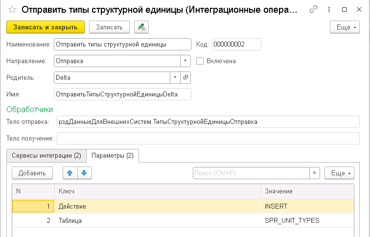

Подсистема создана для взаимодействия с продуктом **1С:Шина**. Позволяет гибко настроить процессы интеграции через формирование и отправку пакетов данных, обработку входящих запросов и управление ошибками. Пакеты формируются и передаются асинхронно, что снижает нагрузку на основную систему и обеспечивает надёжность взаимодействия с внешними системами.

* **Асинхронное выполнение**: Формирование и отправка пакетов осуществляется в фоновом режиме, что предотвращает блокировки и увеличения транзакций при записи данных.

* **Гибкость обработки ошибок**: Пакеты с ошибками могут быть повторно обработаны и отправлены после исправления, что позволяет минимизировать потери данных и сбоев.

* **Разделение ответственности**: Разделение задач на этапы формирования, отправки и обработки пакетов обеспечивает четкую организацию процессов и повышает прозрачность системы.

## Состав

Основные объекты подсистемы и их взаимосвязь представлена на UML диаграмме:


### Справочник “Интеграционная операция“

**Интеграционная операция** — это ключевой объект подсистемы, который отвечает за управление процессом передачи данных между информационными системами. Операция представляет собой абстракцию интеграционного потока и определяет правила обмена данными между системами.


**Основные характеристики:**

1. **Направление операции**:

   * **Отправка** — инициирует передачу данных из системы 1С во внешние системы или сервисы через интеграционную шину.

   * **Получение** — принимает данные, поступающие из внешних систем или сервисов в систему 1С через интеграционную шину.

2. **Активность операции**:
   Если операция отключена, то задачи на формирование пакетов для отправки не создаются и не обрабатываются входящие сообщения для операция с направлением “Получение“. Это позволяет гибко управлять интеграционными процессами, включая и выключая их по мере необходимости.

3. **Обработчики данных**:
   Для каждой интеграционной операции могут быть заданы:

   * **Обработчики для формирования исходящего тела запроса** — отвечают за подготовку данных для отправки в заданном формате, будь то XML, JSON или другой протокол.

   * **Обработчики для обработки входящего тела запроса** — обеспечивают разбор и обработку полученных данных, переводя их в формат, пригодный для обработки в системе 1С.

4. **Интеграционные сервисы и каналы**:
   В операции указываются конкретные **сервисы интеграции** и **каналы**, которые будут использоваться для передачи или приёма сообщений.

5. **Параметры операции**:
   Каждая интеграционная операция может содержать произвольный набор параметров, которые могут использоваться:

   * На стороне 1С:Шина для настройки конкретных аспектов интеграции или обработки данных в зависимости от параметров.

   * В переопределяемых методах подсистемы, что позволяет адаптировать стандартную логику интеграции под конкретные бизнес-процессы.



**Применение:**

Интеграционная операция позволяет настраивать сложные сценарии взаимодействия между информационными системами с возможностью детального управления процессом обмена данными. Через комбинацию обработчиков и параметров достигается высокая степень гибкости и адаптивности в настройке интеграционных процессов.

### Документ “Интеграционный пакет“

Интеграционный пакет — это объект в подсистеме "Интеграционная шина" 1С, который представляет собой подготовленный набор данных для отправки или принятый ответ от внешней системы в рамках интеграционного взаимодействия. Пакеты создаются на основе заданий, сформированных на базе интеграционной операции.


**Основные характеристики:**

1. **Типы интеграционных пакетов:**

   - **Исходящий пакет** — содержит данные, подготовленные для отправки во внешнюю систему через 1С:Шину.
   - **Входящий пакет** — это данные, принятые от внешней системы через 1С:Шину, которые необходимо обработать внутри системы 1С.

2. **Этапы жизненного цикла пакета:**

   - **К отправке** — присваивается статус при создании пакета на основании задания, готового для отправки.
   - **Отправлен** — статус устанавливается после успешной передачи пакета в 1С:Шину.
   - **Принят** — этот статус присваивается пакету при успешном получении ответа от внешнего сервиса или при обработке входящего пакета через 1С:Шину. Если интеграционная операция настроена на обработку ответов, то по завершении обработки полученного ответа пакет также получает статус "**Принят**".
   - **Есть ошибки** — статус, который присваивается пакету в случае, если на каком-либо этапе отправки или обработки данных произошла ошибка. Это может быть ошибка в передаче, некорректный формат данных или другие сбои.

3. **Просмотр содержимого пакета:**\
   Если содержимое пакета хранится в виде строки (например, JSON, XML или другой формат), то его можно просмотреть через интерфейс, используя кнопку "**Посмотреть тело запроса**". Это полезно для диагностики и проверки правильности формирования и обработки данных.

4. **Параметры пакета:**
   

   - Параметры для интеграционного пакета автоматически подтягиваются из настроек интеграционной операции, на основании которой он был создан. Это позволяет избежать дублирования данных и автоматизировать процесс передачи необходимых параметров.
   - Один из предопределённых параметров — **ВидОперации**, который указывается автоматически в зависимости от операции.

5. **Ошибки пакета**:
   
   
   
   На отдельной вкладке пакета можно просматривать ошибки, возникшие на различных этапах работы с ним. Эти ошибки могут содержать:

   - Код ответа от внешнего сервиса (например, HTTP-код ошибки).
   - Содержимое ошибки — текстовое описание проблемы, которое может помочь в диагностике и исправлении неполадок.

6. **Логика обработки входящих пакетов:**\
   Для входящих пакетов важным этапом является их корректная обработка в системе 1С. После успешной обработки входящий пакет также получает статус Принят, что свидетельствует о корректной интеграции и получении данных. Переопределение логики выполняется в методе **рздИнтеграционныеПакетыПереопределяемый.ПриОбработкеПолученияСообщения.**

**Применение:**

Интеграционные пакеты позволяют управлять обменом данными между системами через 1С:Шину. Они обеспечивают возможность отслеживания статусов передачи данных, диагностику ошибок и просмотр передаваемой информации. Благодаря тесной связке с интеграционными операциями, пакеты формируются и обрабатываются автоматически в рамках настроенной логики интеграции.

### Регистр сведений “Задания к формированию интеграционных пакетов“

* При изменении объекта (например, при записи документа или элемента справочника), в регистре фиксируется задание на формирование интеграционного пакета. Это задание содержит информацию о том, какой объект изменён и для какой операции создавать интеграционный пакет.

* Само формирование пакета происходит в фоновом режиме с использованием регламентного задания “**Формирование интеграционных пакетов“**.  Это необходимо для того, чтобы основная транзакция записи объекта не увеличивалась за счет дополнительных операций по формированию интеграционных данных. Если произойдет ошибка в процессе формирования пакета, это не повлияет на запись объекта.

* Для каждого типа объекта (документ, справочник и т.д.) назначается соответствующая интеграционная операция. Определение таких соответствий выполняется в методе "**рздИнтеграционныеОперацииПереопределяемый.ПриЗаполненииОперацийТипаОбъекта**", что позволяет гибко настроить правила формирования пакетов для различных типов данных.

### Регламентное задание “Формирование интеграционных пакетов“

* Отвечает за выполнение асинхронной обработки зарегистрированных заданий и формирование интеграционных пакетов для передачи данных.

* На основании зарегистрированных заданий формируются пакеты данных, которые подготавливаются к отправке во внешние системы. После успешного создания пакета ему присваивается статус "**КОтправке**.

* Если в процессе формирования пакета возникает ошибка, пакет получает статус "**ЕстьОшибки**", что позволяет оперативно отслеживать проблемы. Ошибки можно просмотреть, а также организовать уведомления (например, через электронную почту) для своевременного реагирования.

### Регламентное задание “Отправка интеграционных пакетов“

* Выбираются пакеты со статусом "**КОтправке**", отправляет их через указанные интеграционные каналы и по успешной отправке присваивает пакету статус "**Отправлен**".
* Если в процессе отправки пакета возникли ошибки, пакет помечается как "**ЕстьОшибки**". После исправления ошибок ответственным лицом статус пакета можно изменить на "**КОтправке**", и пакет будет отправлен повторно.

### Регламентное задание “Выполнить обработку сервисов интеграции“

* Выполняет обработку как исходящих, так и входящих сообщений, используя платформенные методы интеграции. Обрабатывает как исходящие пакеты, так и входящие ответы от внешних систем.
* Для пакетов, от которых ожидается ответ, задание обрабатывает полученные сообщения, сопоставляя их по идентификатору с исходящими запросами. В случае успешной обработки ответа пакет получает статус "**Принят**".

## Внедрение

### Шаг 1. Расширяем определяемые типы

* Добавляем в определяемый тип “**рздСинхронизируемыеДанные**“  ссылочные типы.  Это необходимо для регистрации заданий для формирования пакетов.

* Добавляем в определяемый тип “**рздСинхронизируемыеДанныеОбъекты**” или “**рздСинхронизируемыеДанныеНаборы**“ объектные типы для работы подписок на события. Данные набора регистров сведений  при записи выгружаются в ресурс  “**Параметры**“  регистра сведений **рздЗаданияКФормированиюИнтеграционныхПакетов.**

### Шаг 2. Описываем интеграционные операции

1. В методе **рздИнтеграционныеОперацииПереопределяемый.ПриЗаполненииПоставляемыхОпераций** описываем операции. Пример:

   ```
   	Отправка  = ПредопределенноеЗначение("Перечисление.рздНаправленияИнтеграционныхПотоков.Отправка");
   	Получение = ПредопределенноеЗначение("Перечисление.рздНаправленияИнтеграционныхПотоков.Получение");
   	
   	Описание = рздИнтеграционныеОперации.ОписаниеОперации();
   	Описание.ИмяОперации   = "ОтправитьТипыСтруктурнойЕдиницыDelta";
   	Описание.Идентификатор = "d84894b7-866f-49cb-bb66-ab420473cf31";
   	Описание.Наименование  = "Отправить типы структурной единицы";
   	Описание.Направление   = Отправка;
   	Описание.Родитель      = Группа;
   	
   	Описание.ОбработчикТелоОтправка = "рздДанныеДляВнешнихСистем.ТипыСтруктурнойЕдиницыОтправка";
   	
   	НовыйСервис = Описание.СервисыИнтеграции.Добавить();
   	НовыйСервис.Сервис      = "рздDelta";
   	НовыйСервис.Направление = Отправка;
   	НовыйСервис.Канал       = "Основной_Delta_Канал1СИсточник";
   	
   	НовыйСервис = Описание.СервисыИнтеграции.Добавить();
   	НовыйСервис.Сервис      = "рздDelta";
   	НовыйСервис.Направление = Получение;
   	НовыйСервис.Канал       = "Основной_Delta_Канал1СНазначение";
   	
   	НовыйПараметр = Описание.Параметры.Добавить();
   	НовыйПараметр.Ключ     = "Действие";
   	НовыйПараметр.Значение = "INSERT";
   	
   	НовыйПараметр = Описание.Параметры.Добавить();
   	НовыйПараметр.Ключ      = "Таблица";
   	НовыйПараметр.Значение = "SPR_UNIT_TYPES ";
   	
   	рздИнтеграционныеОперации.ДобавитьОписание(Описания, Описание);
   ```

2. Прописываем соответствие типов для операций в методе **рздИнтеграционныеОперацииПереопределяемый.ПриЗаполненииОперацийТипаОбъекта**. Пример:

   ```
   Процедура ПриЗаполненииОперацийТипаОбъекта(Соответствие) Экспорт
   	
   	Операции = ОбщегоНазначенияКлиентСервер.ЗначениеВМассиве("ОтправитьТипыСтруктурнойЕдиницыDelta");
   	Соответствие.Вставить(Тип("СправочникОбъект.рздТипыСтруктурнойЕдиницы"), Операции);
   	
   	Операции = ОбщегоНазначенияКлиентСервер.ЗначениеВМассиве("ОтправитьДеревоСтруктурыПредприятияDelta");
   	Соответствие.Вставить(Тип("РегистрСведенийНаборЗаписей.рздДеревоСтруктурыПредприятия"), Операции);
   	
   КонецПроцедуры
   ```

### Шаг 3. Переопределяем установку тела

* Для того чтобы подсистема формировала тело пакета по соответствующему обработчику операции нужно в методе **рздИнтеграционныеПакетыПереопределяемый.ПриФормированиеПакетаПоЗаданию** прописать соответствующий метод. Пример:

  ```
  Процедура ПриФормированиеПакетаПоЗаданию(НовыйПакет, ПараметрыЗадания) Экспорт
  	
  	рздИнтеграционныеПакеты.УстановитьТелоПакета(НовыйПакет, ПараметрыЗадания);
  	
  КонецПроцедуры
  ```

### Шаг 4. Переопределяем обработку получения сообщения

* Для того чтобы подсистема обрабатывала обратное сообщение по отправленному пакету нужно в методе **рздИнтеграционныеПакетыПереопределяемый.ПриОбработкеПолученияСообщения** прописать соответствующий метод. Пример:

  ```
  Процедура ПриОбработкеПолученияСообщения(Сервис, Канал, Сообщение, Операция, Тело) Экспорт
  	
  	КодОтвета = Сообщение.Параметры.Получить("result");
  	Ошибка    = Сообщение.Параметры.Получить("error");
  	
  	ОшибкиПакета = ОшибкиСообщения(КодОтвета, Ошибка);
  	
  	рздИнтеграционныеПакеты.ОбработатьПринятиеПакета(Сообщение, ОшибкиПакета);
  	
  КонецПроцедуры
  ```

### Шаг 5. Включаем Операции и Регламентные задания

* В пользовательском режиме включаем нужные интеграционные операции

* В пользовательском режиме настраиваем и включаем регламентные задание

## Процесс


**Описание шагов:**

1. **Изменение объекта в 1С:** Начало процесса — изменение бизнес-объекта.

2. **Проверка необходимости интеграции:** Если для объекта требуется интеграция, создаётся задание на формирование пакета.

3. **Формирование интеграционного пакета:** В фоновом режиме создаётся интеграционный пакет и присваивается статус "**КОтправке**".

4. **Отправка пакета:** Пакет отправляется внешней системе. В случае успеха присваивается статус "**Отправлен**", в случае ошибки — "**ЕстьОшибки**".

5. **Ожидание ответа:** Если ожидается ответ от внешней системы, он обрабатывается. При успешной обработке пакет получает статус "**Принят**", при ошибке — "**ЕстьОшибки**".

6. **Завершение интеграции:** Процесс завершается после успешной отправки и приёма данных.

Эта диаграмма описывает основной процесс обмена данными через интеграционную шину, начиная с создания задания и заканчивая успешной отправкой и обработкой ответов от внешней системы.