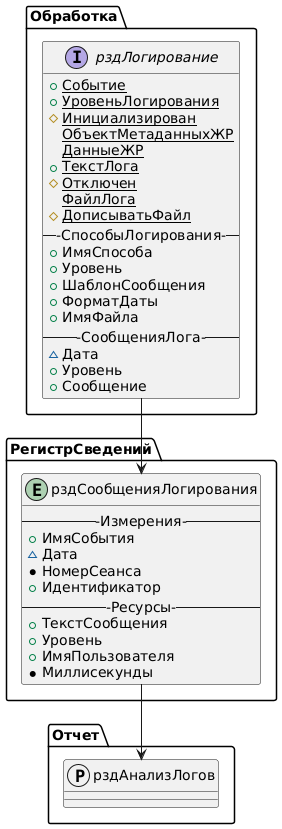

## Состав

1. Обработка.рздЛогирование (ядро функционала)

2. ОбщийМодуль.рздЛог (обертки для удобной работы)

3. РегистрСведений.рздСообщенияЛогирования

4. Отчет.рздАнализЛогов

<p align="center">
    
 </p> 

## Источник

При разработке вдохновлялись следующими материалами:

* [Простая обработка для логирования в 1С](https://github.com/codenull/log1c/tree/master)

## Использование

### Инициализация

Для начала работы с объектом логирования необходимо выполнить его инициализацию следующим образом:

```bsl
Лог = Обработки.рздЛогирование.Создать();
Лог.Инициализировать("ОбменДанными.Тестирование");
```

Процедура Инициализировать() является обязательной, в ней производится первоначальная настройка объекта обработки,установка имени лога/события и уровня лога. Если имя лога не задано, то будет использоваться значение по умолчанию - "Логирование".

```bsl
// Инициализирует объект логирования с указанными настройками.
//
// Параметры:
//  ИмяСобытия	 - Строка	 - имя события/лога.
//  Уровень	 - Строка	 - уровень логирования.
//
Процедура Инициализировать(ИмяСобытия = "Логирование", Уровень = "ИНФОРМАЦИЯ") Экспорт
```

Пример создание лога с помощью общего модуля **рздЛог:**

```
ПараметрыЛога = рздЛог.ПараметрыЛога();
ПараметрыЛога.ДописыватьФайл  = Ложь;
ПараметрыЛога.ПутьФайла       = "S:\log.txt";
ПараметрыЛога.ШаблонСообщения = рздЛог.ШаблонСообщенияКороткий();

Лог = рздЛог.НовыйЛог("ОбменДанными.Тестирование", , "База,Консоль,Файл", ПараметрыЛога);
Лог.Информация("Привет, мир");
```

### Уровни логирования и основные методы

В обработке используется 4 уровня логирования (по возрастанию приоритета):

1. ОТЛАДКА
2. ИНФОРМАЦИЯ
3. ПРЕДУПРЕЖДЕНИЕ
4. ОШИБКА

По умолчанию используется уровень логирования ИНФОРМАЦИЯ. При установке какого-либо уровня, в лог будут выводиться только сообщения этого уровня и уровней с большим приоритетом. Например, если установлен уровень ИНФОРМАЦИЯ то будут выводиться сообщения следующих уровней: ИНФОРМАЦИЯ, ПРЕДУПРЕЖДЕНИЕ, ОШИБКА.

Уровень логирования можно изменить с помощью метода *УстановитьУровень()*:

```bsl
Лог.УстановитьУровень("Информация");
```

Каждому уровню логирования соответствует свой метод вывода информации:

```bsl
Лог.Отладка("Отладочное сообщение");
Лог.Информация("Информационное сообщение");
Лог.Предупредить("Предупредительное сообщение"); // можно использовать Лог._Предупреждение()
Лог.Ошибка("Сообщение об ошибке");
```

### Логирование в консоль сообщений

Для включения логирования в окно сообщений используется метод *ДобавитьСпособЛогированияКонсоль()*.

```bsl
Лог = Обработки.рздЛогирование.Создать();
Лог.Инициализировать("Логирование");
Лог.ДобавитьСпособЛогированияКонсоль();
Лог.Информация("Тест");
```

```bsl
// Добавляет логирование в консоль (окно сообщений).
//
// Параметры:
//  ШаблонСообщения	 - Строка	 - шаблон сообщения строки лога, если не задан, то будет использоваться шаблон по-умолчанию.
//  ФорматДаты		 - Строка	 - формат даты, который будет использоваться при заполнении шаблона сообщения.
//
Процедура ДобавитьСпособЛогированияКонсоль(Знач ШаблонСообщения = "", Знач ФорматДаты = "") Экспорт
```

### Логирование в журнал регистрации

Для добавления логирования в журнал регистрации используется метод *ДобавитьСпособЛогированияЖурналРегистрации()*.

```bsl
Лог = Обработки.рздЛогирование.Создать();
Лог.Инициализировать("ОбменДанными.Тестирование");
Лог.ДобавитьСпособЛогированияЖурналРегистрации();
```

```bsl
// Добавляет логирование в журнал регистрации.
//
// Параметры:
//  ОбъектМетаданных 	 - ОбъектМетаданных	 - объект метаданных, к которому будут привязаны сообщения лога в журнале регистрации.
//  ДанныеДляЖурнала 	 - ЛюбаяСсылка		 - ссылка на объект, к которому будут привязаны сообщения лога в журнале регистрации.
//  ШаблонСообщения	 - Строка		 - шаблон сообщения строки лога, если не задан, то будет использоваться шаблон по-умолчанию.
//  ФорматДаты		 - Строка		 - формат даты, который будет использоваться при заполнении шаблона сообщения.
//
Процедура ДобавитьСпособЛогированияЖурналРегистрации(ОбъектМетаданных = Неопределено, ДанныеДляЖурнала = Неопределено, Знач ШаблонСообщения = "", Знач ФорматДаты = "") Экспорт
```

При логировании в журнал регистрации, можно изменить объект метаданных и данные, к которым привязан лог, с помощью методов: *УстановитьДанные()* и *УстановитьМетаданные()*:

```bsl
// Устанавливает ссылку на данные, которые будут использоваться при записи в журнал регистрации.
//
// Параметры:
//  Ссылка	 - ЛюбаяСсылка	 - ссылка на данные, к которым будет привязываться лог в журнале регистрации.
//
Процедура УстановитьДанные(Ссылка) Экспорт
```

```bsl
// Установить метаданные, к которым будет привязан лог при записи в журнал регистрации.
//
// Параметры:
//  ОбъектМетаданных - ОбъектМетаданных	 - объект метаданных к которому нужно привязать лог.
//
Процедура УстановитьМетаданные(ОбъектМетаданных) Экспорт
```

### Логирование в память

Под логированием в память подразумевается хранение сообщений лога в объекте обработки (табличная часть *СообщенияЛога*). Подключение логирования выполняется с помощью процедуры *ДобавитьСпособЛогированияПамять()*.

```bsl
Лог.ДобавитьСпособЛогированияПамять();
```

```bsl
// Добавляет логирование в табличную часть обработки СообщенияЛога.
//
// Параметры:
//  ШаблонСообщения	 - Строка	 - шаблон сообщения строки лога, если не задан, то будет использоваться шаблон по-умолчанию.
//  ФорматДаты		 - Строка	 - формат даты, который будет использоваться при заполнении шаблона сообщения.
//
Процедура ДобавитьСпособЛогированияПамять(Знач ШаблонСообщения = "", Знач ФорматДаты = "") Экспорт
```

Для логирования в память существует вспомогательный метод, который позволяет получить весь лог одной строкой:

```bsl
ТекстЛога = Лог.ПолучитьЛогИзПамяти()
```

```bsl
// Формирует текстовое представление лога из памяти (табличной части обработки).
//
// Параметры:
//  Очистить - Булево	 - при установке в Истина очищает накопленные сообщения.
// 
// Возвращаемое значение:
//  Строка - строка с накопленными в памяти логами.
//
Функция ЛогИзПамяти(Очистить = Ложь) Экспорт
```

### Логирование в файл

Для подключения логирования в файл необходимо вызвать метод ДобавитьСпособЛогированияФайл().

```bsl
// Добавляет логирование в указанный файл.
// Параметры
//     ПутьФайла        - Строка - полный путь до файла лога.
//     Кодировка        - Строка - кодировка в которой будет записываться лог.
//     ШаблонСообщения  - Строка - шаблон сообщения строки лога, если не задан, то будет использоваться шаблон по-умолчанию.
//     ФорматДаты       - Строка - формат даты, который будет использоваться при заполнении шаблона сообщения.
Процедура ДобавитьСпособЛогированияФайл(Знач ПутьФайла, Знач Кодировка="utf-8", Знач ШаблонСообщения="", Знач ФорматДаты="")
```

Пример использования:

```bsl
Лог = Обработки.рздЛогирование.Создать();
Лог.Инициализировать("Логирование");
Лог.ДобавитьСпособЛогированияФайл("\\localhost\Logs\log.txt");
Лог.Информация("Тест");
Лог.Закрыть();  // освободит захваченные ресурсы и разблокирует файл лога.
```

*ВАЖНО:* при завершении логирования в файл рекомендуется освободить захваченные ресурсы используя процедуру Закрыть().

В обработке предусмотрен реквизит **ДописыватьФайл (Булево)** для управления содержимым файлом (перезаписать/дополнить). По умолчанию **Истина**.

### Логирование в базу

Под логированием в базе подразумевается хранение сообщений лога в регистре сведений **рздСообщенияЛогирования**. Для подключения логирования необходимо вызвать метод ДобавитьСпособЛогированияБаза().

```bsl
// Добавляет логирование в базу в специальный регистр сведений.
//
// Параметры:
//  ШаблонСообщения	 - Строка	 - шаблон сообщения строки лога, если не задан, то будет использоваться шаблон по-умолчанию.
//  ФорматДаты		 - Строка	 - формат даты, который будет использоваться при заполнении шаблона сообщения.
//
Процедура ДобавитьСпособЛогированияБаза(Знач ШаблонСообщения = "", Знач ФорматДаты = "") Экспорт
```

Пример использования:

```bsl
Лог = Обработки.рздЛогирование.Создать();
Лог.Инициализировать("Логирование");
Лог.ДобавитьСпособЛогированияБаза();
Лог.УдалитьИзБазы(); // Удалим ранее созданные логи по событию
Лог.Информация("Тест");
```

В общем модуле **рздЛог** есть дополнительные методы, которые позволяют работать с регистром логов без использования обработки логирования:

```
// Добавляет запись в регистр логирования
//
// Параметры:
//  Событие		 - Строка - имя события/лога.
//  Сообщение	 - Строка - текст сообщения.
//  Уровень		 - Строка - уровень логирования.
//
Процедура ЗаписьВРегистр(Событие, Знач Сообщение, Знач Уровень = "ИНФОРМАЦИЯ") Экспорт
```

```
// Удаляет лог из регистра
//
// Параметры:
//  Событие	 - Строка - имя события/лога.
//
Процедура УдалитьИзРегистра(Событие) Экспорт
```

### Шаблон сообщения

При добавлении способов вывода для них можно задать свой шаблон сообщения. В шаблонах поддерживаются следующие псевдонимы:

* **%УРОВЕНЬ%**- уровень лога которым было сформировано сообщение (например: ИНФОРМАЦИЯ).
* **%СОБЫТИЕ%**   - указанное событие логирования (имя лога).
* **%СООБЩЕНИЕ%** - текст выводимого сообщения.
* **%ДАТА%** - дата и время в формате yyyy.MM.dd HH:mm:ss (например: 2020.09.16 23:52:49), либо в пользовательском формате заданном через параметр ФорматДаты.
* **%ДАТАМС%** - количество миллисекунд текущей даты.
* **%УНИВЕРСАЛЬНАЯДАТАМС%** - универсальная дата полученная с помощью функции ТекущаяУниверсальнаяДатаВМиллисекундах().

**ВАЖНО:** псевдонимы регистрозависмые и допускается их указание только в верхнем регистре.

Пример шаблона:

```bsl
Лог = ВнешниеОбработки.Создать("D:\Projects\log1c\рздЛогирование.epf");
Лог.Инициализировать("Логирование.Тест");
Лог.ДобавитьСпособЛогированияКонсоль("%ДАТА%.%ДАТАМС% - %УНИВЕРСАЛЬНАЯДАТАМС% - %СОБЫТИЕ% - %УРОВЕНЬ% - %СООБЩЕНИЕ%");
Лог.Предупредить("Предупредительное 1 сообщение");
```

```
2020.09.16 23:53:08.771 - 63735861188771 - Логирование.Тест - ПРЕДУПРЕЖДЕНИЕ - Предупредительное 1 сообщение
```

### Отключение логирования

Метод *Отключить()* позволяет выключить логирование, обратное включение осуществляется методом *Включить()*. Это может быть удобным, если требуется отключить логи на определенном участке кода или полностью отключить их (например, в рабочих базах) без удаления кода логирования.

```bsl
Лог = ВнешниеОбработки.Создать("D:\Projects\log1c\рздЛогирование.epf");
Лог.Инициализировать("Логирование.Тест");
Лог.УстановитьУровень("ОТЛАДКА");
Лог.ДобавитьСпособЛогированияКонсоль("%ДАТА%.%ДАТАМС% - %СОБЫТИЕ% - %УРОВЕНЬ% - %СООБЩЕНИЕ%");

Лог.Предупредить("Предупредительное 1 сообщение");

Лог.Отключить();
Лог.Предупредить("Предупредительное 2 сообщение"); // не будет выведено
Лог.Включить();

Лог.Ошибка("Сообщение об ошибке");
```

```bsl
2020.09.17 11:28:12.623 - Логирование.Тест - ОШИБКА - Ошибочное сообщение
2020.09.17 11:28:24.460 - Логирование.Тест - ПРЕДУПРЕЖДЕНИЕ - Предупредительное 1 сообщение
2020.09.17 11:28:24.468 - Логирование.Тест - ОШИБКА - Ошибочное сообщение
```

### Использование внешней обработки

Объект логирования можно создать из внешний обработки, что удобно в некоторых ситуациях. Например, при отладке правил обмена КД 2.0.

```bsl
Лог = ВнешниеОбработки.Создать("D:\Projects\log1c\рздЛогирование.epf");
Лог.Инициализировать("Логирование");
Лог.ДобавитьСпособЛогированияКонсоль();
Лог.Информация("Информационное сообщение");
```