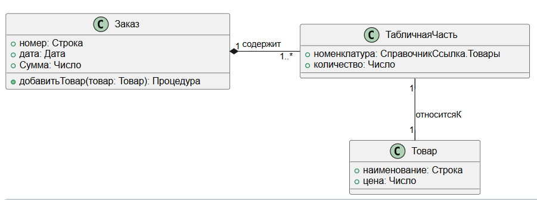

## Зачем нужны диаграммы классов?

Диаграмма классов в UML (Unified Modeling Language) представляет собой статическую модель, отображающую структуру системы. Она помогает:

1. **Понять и документировать предметную область:**
   Определяет основные классы и их роли в системе.

2. **Показать атрибуты классов:**
   Включает свойства и их примитивные типы (например, `Строка`, `Число`, `Булево`).

3. **Отобразить связи и ассоциации между классами:**
   Например, "один-к-одному", "один-ко-многим", композиции и агрегации.

4. **Определить зависимости между классами:**
   Демонстрирует, как изменение в одном классе может повлиять на другой.

5. **Описать операции и методы класса:**
   Определяет, какие функции реализует класс.

6. **Показать реализацию интерфейсов:**
   Выделяет, какие интерфейсы реализует класс.

7. **Служить основой для проектирования объектов метаданных:**
   Диаграмма используется как макет для настройки объектов, таких как справочники, документы, регистры в 1С.

---

## Основные элементы диаграммы классов:

### Классы

Класс – это ключевая сущность, описывающая объект или концепцию системы.
**Пример UML-синтаксиса:**

```
+----------------------+
|       Класс          |
+----------------------+
| атрибут1: Тип        |
| атрибут2: Тип        |
+----------------------+
| метод1(): Тип        |
| метод2(параметр): Тип|
+----------------------+

```

### Ассоциации

Ассоциации показывают связи между классами.

* **Пример:** "Заказ" связан с "Товаром", так как заказ содержит товары.

* **Типы:**

  * **Простая ассоциация:** Линия между двумя классами.

    ```
    Заказ ----------------- Товар
    
    ```

  * **Агрегация:** У одного объекта есть другой, но они могут существовать независимо (полый ромб).

    ```
    Заказ <>----------------- Товар
    
    ```

  * **Композиция:** Один объект является частью другого и не может существовать отдельно (заполненный ромб).

    ```
    ТабличнаяЧасть <#>------------- Документ
    
    ```

### Атрибуты

* Атрибуты описывают свойства класса.

* Типы атрибутов должны быть **примитивными** (например, `String`, `Integer`, `Boolean`).

* **Пример:**

  ```
  Заказ
  + номер: Строка
  + дата: Дата
  + общаяСумма: Число
  
  ```

### Методы

Методы описывают поведение класса.

* Указываются с параметрами и типом возвращаемого значения.

* **Пример:**

  ```
  + добавитьТовар(товар: Товар): Процедура
  
  ```

### Зависимости

* Показывают, что класс зависит от другого.

* Обозначаются **пунктирной стрелкой**, направленной от клиента к поставщику.

* Используются, если:

  * Класс использует глобальные переменные.

  * Класс передает или принимает объект через параметры.

  * Класс вызывает статический метод другого класса.

**Пример:**

```
Клиент ..> Сервис : Использует

```

### Обозначение метаданных

```
'---- Типы объектов ----
Class =Справочник
Abstract =Документ
Protocol =Отчет
Interface =Обработка
Entity =РегистрСведений
Entity =РегистрБухгалтерии
Enum =РегистрНакопления
Enum =РегистрРасчета
Struct =ПланВидовХарактеристик
Struct =ПланВидовРасчета
Struct =ПланСчетов
Annotation =Задача
Protocol =БизнесПроцесс
Protocol =Все_другие_объекты

Protocol Обозначения_Типов_Данных{
	-Ссылка // красный квадратик
	#Булево // желтый ромбик
	~Дата   // синий треугольник
	*Число  // черная точка
	+Строка // зелёный кружок
}

Protocol =Обозначения_Полей_Регистра{
	-Измерение // красный квадратик
	~Реквизит // синий треугольник
	+Ресурс // зелёный кружок
}
```

---

## Взаимосвязь с диаграммой взаимодействия:

1. **Начнем с взаимодействия:**
   Диаграммы взаимодействия помогают определить, какие классы и связи необходимы.

2. **Строим диаграмму классов:**

   * После понимания, как объекты взаимодействуют, добавляются их атрибуты, методы и связи.

3. **Иногда создаются параллельно:**
   В сложных системах разработка диаграмм может идти одновременно.

---

## Шаги для создания диаграммы классов:

1. **Анализ прецедентов:**
   Выделите концептуальные классы из описания прецедентов.

2. **Определите атрибуты:**
   Укажите свойства для каждого класса.

3. **Определите связи:**

   * Укажите, как классы связаны.

   * Выберите типы связей: ассоциация, агрегация, композиция.

   * Добавьте кратность (например, "1", "\*", "0..1").

4. **Добавьте методы:**
   Определите поведение классов, которое требуется для реализации сценариев.

5. **Проверьте зависимости:**
   Добавьте зависимости между классами, если они используют друг друга через глобальные переменные или методы.

6. **Проверьте корректность:**
   Убедитесь, что все элементы соответствуют терминологии предметной области.

---

## Пример диаграммы классов в PlantUML



```
@startuml
class Заказ {
  +номер: Строка
  +дата: Дата
  +Сумма: Число
  +добавитьТовар(товар: Товар): Процедура
}

class Товар {
  +наименование: Строка
  +цена: Число
}

class ТабличнаяЧасть {
  +номенклатура: СправочникСсылка.Товары
  +количество: Число
}

Заказ "1" *- "1..*" ТабличнаяЧасть : содержит
ТабличнаяЧасть "1" -- "1" Товар : относитсяК
@enduml
```

**Описание:**

1. **Классы:** "Заказ", "Товар", "ТабличнаяЧасть".

2. **Ассоциации:**

   * "Заказ" содержит "ТабличнуюЧасть" (композиция).

   * "ТабличнаяЧасть" относится к "Товару" (простая ассоциация).

3. **Атрибуты и методы:** Указаны в каждом классе.

[Справка по синтаксису](https://plantuml.com/ru-dark/class-diagram)

[Плагин для VS Code](https://logrocon.ru/news/plantuml_visualstudiocode)

[Онлайн редактор PlantUML](https://www.planttext.com/)

[Онлайн редактор графический](https://app.diagrams.net/)