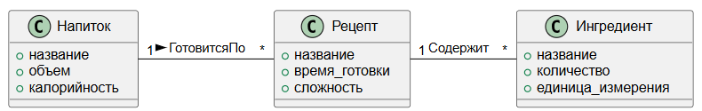

## Теория

### Что такое модель предметной области?

**Модель предметной области** – это основа для общения между участниками проекта. Она представляет собой визуализацию ключевых понятий, их свойств и взаимосвязей, характерных для предметной области, без привязки к программной реализации.

### Основные цели модели:

- **Единый язык:** Обеспечение общего понимания между разработчиками и специалистами предметной области.
- **Структурирование знаний:** Преобразование требований и описаний прецедентов в четкую и логичную структуру.
- **Базис для реализации:** Служит основой для дальнейшего проектирования и программирования.

---

## Основные понятия

### Концептуальный класс

Концептуальные классы представляют собой ключевые понятия или объекты предметной области. Они выделяются на основе анализа требований и описаний прецедентов.

Примеры концептуальных классов:

- В предметной области "Кафе": *Напиток*, *Рецепт*, *Ингредиент*.
- В предметной области "Библиотека": *Книга*, *Автор*, *Читатель*.

> Если объект не является примитивным (например, числом или строкой), скорее всего, это концептуальный класс.

---

### Связи (Ассоциации)

Ассоциации описывают, как классы взаимодействуют друг с другом в предметной области.

- **Формат:**

  ```
  ИмяТипа - ГлагольнаяФраза - ИмяТипа
  ```

  Пример:

  ```
  Напиток - ГотовитсяПо - Рецепт
  ```

- **Роли ассоциаций:**

  - Кратность (например, "1", "\*", "0..1").
  - Направление связи.\
    Пример:

  ```
  Напиток (1) - ГотовитсяПо - Рецепт (*)
  ```

### Атрибуты

Атрибуты – это свойства классов, выраженные через простые типы данных (числа, строки, даты и т.п.).\
Пример:

- Класс "Напиток" может иметь атрибуты: *название*, *объем*, *калорийность*.

---

## Создание модели предметной области

**Шаги:**

1. **Анализ описания прецедента:**\
   Выделите существительные из текста (ключевые понятия).

2. **Определение классов:**\
   Из выделенных существительных отберите те, которые представляют реальные объекты или концепции.

3. **Построение диаграммы концептуальных классов:**

   - Изобразите классы как прямоугольники с названиями.
   - Добавьте связи (ассоциации) между классами.
   - При необходимости укажите атрибуты и кратности.

4. **Уточнение модели:**

   - Убедитесь, что модель отражает терминологию предметной области.
   - Исключите программные термины и детали реализации.

---

## Пример модели

### Описание прецедента:

**Прецедент:** "Приготовление напитка"\
**Основной успешный сценарий:**

1. Пользователь выбирает рецепт.
2. Система отображает список ингредиентов.
3. Пользователь подтверждает приготовление.
4. Напиток готовится.

---

### Выделенные концептуальные классы:

- Напиток
- Рецепт
- Ингредиент

---

### Диаграмма концептуальных классов (PlantUML)



```
@startuml
' Определение классов
class Напиток {
  +название
  +объем
  +калорийность
}

class Рецепт {
  +название
  +время_готовки
  +сложность
}

class Ингредиент {
  +название
  +количество
  +единица_измерения
}

' Определение связей
Напиток "1" - "*" Рецепт : ГотовитсяПо >
Рецепт "1" - "*" Ингредиент : Содержит
@enduml
```

Если нужно разместить классы горизонтально нужно использовать **--**

```
Напиток "1" -- "*" Рецепт : ГотовитсяПо >
Рецепт "1" -- "*" Ингредиент : Содержит
```

[Справка по синтаксису](https://plantuml.com/ru-dark/class-diagram)

[Плагин для VS Code](https://logrocon.ru/news/plantuml_visualstudiocode)

[Онлайн редактор PlantUML](https://www.planttext.com/)

[Онлайн редактор графический](https://app.diagrams.net/)

---

## Советы для разработчиков

1. **Анализируйте термины предметной области:**\
   Избегайте технических терминов, используйте язык заказчика и аналитика.

2. **Ищите связи и зависимости:**\
   Определите, какие классы связаны, и какие ассоциации между ними наиболее логичны.

3. **Добавляйте только необходимые атрибуты:**\
   Не перегружайте модель, добавляйте свойства только при необходимости.

4. **Обсуждайте модель с аналитиками и предметными экспертами:**\
   Убедитесь, что она правильно отражает суть предметной области.