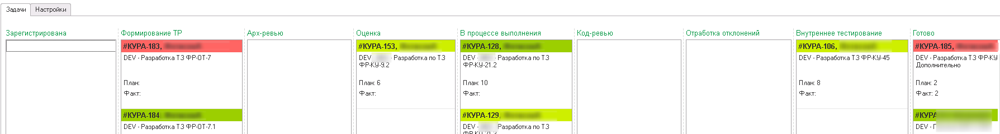

## Подготовка конфигурации
1. Добавить [**БПР (Библиотека проектных решений).**](../psl) 

    Сформировать поставку с последней версией с нужными подсистемами для проекта.
​
2. Согласно [инструкции БСП](https://its.1c.ru/db/bsp319doc#content:4:hdoc:issogl3_%D0%BF%D0%BE%D0%B4%D0%BA%D0%BB%D1%8E%D1%87%D0%B5%D0%BD%D0%B8%D0%B5_%D0%BE%D0%B1%D1%80%D0%B0%D0%B1%D0%BE%D1%82%D1%87%D0%B8%D0%BA%D0%BE%D0%B2_%D0%BE%D0%B1%D0%BD%D0%BE%D0%B2%D0%BB%D0%B5%D0%BD%D0%B8%D1%8F_%D0%B2_%D0%B4%D0%BE%D1%80%D0%B0%D0%B1%D0%BE%D1%82%D0%B0%D0%BD%D0%BD%D1%8B%D1%85_%D0%BA%D0%BE%D0%BD%D1%84%D0%B8%D0%B3%D1%83%D1%80%D0%B0%D1%86%D0%B8%D1%8F%D1%85) подключить обработчики обновления. 

    Для этого нужно:

    Создать общий модуль **рздОбновлениеИнформационнойБазы**, заполнить его аналогично модулям такого назначения. В методе **ПриДобавленииПодсистемы** заполнить информацию, пример:
​
    ```
    Процедура ПриДобавленииПодсистемы(Описание) Экспорт
        
        Описание.Имя    = "рздЗарплатаИУправлениеПерсоналомКОРП";
        Описание.Версия = "3.1.27.95";
        
        Описание.ТребуемыеПодсистемы.Добавить("СтандартныеПодсистемы");
        Описание.ТребуемыеПодсистемы.Добавить("ЗарплатаИУправлениеПерсоналомКОРП");
        Описание.ТребуемыеПодсистемы.Добавить("рздБиблиотекаПроектныхРешений");
        
    КонецПроцедур
    ```
    
    **ВАЖНО**, чтобы в требуемых подсистемах были **СтандартныеПодсистемы** и **рздБиблиотекаПроектныхРешений.** Начальная версия берется из корня конфигурации. При изменении увеличиваются последние цифры (номер сборки) на +1 для автоматического запуска обработчиков обновления.

3. В модуле **ПодсистемыКонфигурацииПереопределяемый** добавить в метод **ПриДобавленииПодсистем** наши модули для обновления:
​
    ```
    МодулиПодсистем.Добавить("рздОбновлениеИнформационнойБазы");
    МодулиПодсистем.Добавить("рздОбновлениеИнформационнойБазыБПР");
    ```
    
4. Создать служебную подсистему, имя которой указывали в модуле  **рздОбновлениеИнформационнойБазы.**

    В ней будут создаваться подчиненные подсистемы по разделам, в которых будут указываться все новые объекты.
​
## Действия перед разработкой
1. Получить все изменения из хранилища.
​
2. Запустить в пользовательском режиме (если процесса обновление не было - запустить с ключом **ЗапуститьОбновлениеИнформационнойБазы)**.
​
3. Убедиться, что в регистре сведений **Версии подсистем** появились наши подсистемы.

​База готова к разработке.

## Задачи
Задачи ведутся во внутренней конфигурации по управлению задач:


Статусы для разработки:

1. Зарегистрирована
2. Формирование ТР
3. Арх-ревью
4. Оценка
5. В процессе выполнения
6. Код-ревью
7. Отработка отклонений
8. Внутреннее тестирование
9. Готово