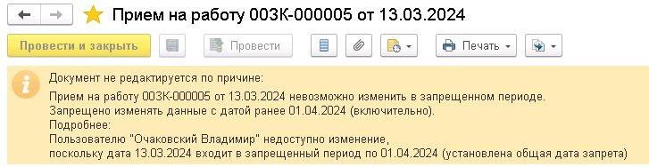

Если в типовой конфигурации есть модули **БлокировкаИзмененияОбъектов** тогда блокировка форм должна осуществляться через этот механизм. 


Если подключается дата запрета к новому документу, нужно не забыть подключить блокировку форм.
  

## Подготовка формы

В форме документа должны быть следующие методы (если нету тогда воспользоваться механизмом БПР “[Программная доработка форм](../psl/modification_forms.md)":

**ПриСозданииНаСервере**:

```
БлокировкаИзмененияОбъектов.ПриСозданииНаСервереФормыОбъекта(Форма, Отказ, СтандартнаяОбработка);
```

**ПриЧтенииНаСервере**:

```
БлокировкаИзмененияОбъектов.ПриЧтенииНаСервереФормыОбъекта(Форма, ТекущийОбъект);
```

**ПослеЗаписиНаСервере:**

```
БлокировкаИзмененияОбъектов.ПослеЗаписиНаСервереФормыОбъекта(Форма, ТекущийОбъект, ПараметрыЗаписи);
```

**Модуль формы:**

```
&НаКлиенте
Процедура Подключаемый_РазблокироватьФормуОбъекта(Команда)
	
	БлокировкаИзмененияОбъектовКлиент.РазблокироватьФормуОбъекта(ЭтотОбъект, Объект.Ссылка);
	
КонецПроцедуры
```

## Подключение

Для подключения нужно:

1. Создать свой модуль **рздБлокировкаИзмененияОбъектов**.

2. Создаем модуль **рздБлокировкаИзмененияОбъектовПовтИсп**.

3. В методе **БлокировкаИзмененияОбъектовРасширенный.ПараметрыБлокировкиИзмененияОбъекта** подключить наш модуль:

   ```
	// рзд Очаковский В.М 11.01.2024 {
	ТипСтрокой = XMLТип(ТипЗнч(СсылкаНаОбъект)).ИмяТипа;
	Если рздБлокировкаИзмененияОбъектовПовтИсп.ДоступныТиповыеБлокировки(ТипСтрокой) Тогда
		КоллекцияБлокировок = БлокировкаИзмененияОбъектовБазовый.ПараметрыБлокировкиИзмененияОбъекта(СсылкаНаОбъект, УправляемаяФорма);
	Иначе
		КоллекцияБлокировок = рздБлокировкаИзмененияОбъектов.ПараметрыБазовойБлокировкиИзмененияОбъекта(СсылкаНаОбъект, УправляемаяФорма);
	КонецЕсли;
	// }рзд Очаковский В.М 11.01.2024

   // рзд Очаковский В.М 11.01.2024 {
   рздБлокировкаИзмененияОбъектов.ДобавитьБлокировкуИзмененияОбъекта(КоллекцияБлокировок, СсылкаНаОбъект, УправляемаяФорма);
   // }рзд Очаковский В.М 11.01.2024
   ```

## Добавление проверок

<details>
  <summary>Пример модуля **рздБлокировкаИзмененияОбъектов** со своими проверками</summary>

```
#Область СлужебныйПрограммныйИнтерфейс

Процедура ДобавитьБлокировкуИзмененияОбъекта(КоллекцияБлокировок, СсылкаНаОбъект, УправляемаяФорма) Экспорт
	
	ТипОбъекта = ТипЗнч(СсылкаНаОбъект);
	
	Если ТипОбъекта = Тип("ДокументСсылка.ЭтапПроизводства2_2") Тогда
		ДобавитьБлокировкиЭтапаПроизводства(КоллекцияБлокировок, СсылкаНаОбъект, УправляемаяФорма);
	КонецЕсли;
	
КонецПроцедуры

Функция ПараметрыБазовойБлокировкиИзмененияОбъекта(СсылкаНаОбъект, УправляемаяФорма) Экспорт
	
	КоллекцияБлокировок = Новый Массив;
	МетаданныеОбъекта = СсылкаНаОбъект.Метаданные();
	Если Не ПравоДоступа("Изменение", МетаданныеОбъекта) Тогда
		БлокировкаИзмененияОбъекта = БлокировкаИзмененияОбъектов.ОписаниеБлокировкиИзмененияОбъекта("ПраваИзмененияОбъекта",
		НСтр("ru = 'Нет прав на изменение'"), Ложь);
		КоллекцияБлокировок.Добавить(БлокировкаИзмененияОбъекта);
	Иначе
		ОписаниеРезультата = "";
		ИзменениеЗапрещено = ДатыЗапретаИзменения.ИзменениеЗапрещено(МетаданныеОбъекта.ПолноеИмя(), СсылкаНаОбъект , ОписаниеРезультата);
		Если ИзменениеЗапрещено Тогда
			Если Не ПустаяСтрока(ОписаниеРезультата) Тогда
				ОписаниеРезультата = СокрЛП(ОписаниеРезультата);
				ОписаниеРезультата = СтрЗаменить(ОписаниеРезультата, Символы.ПС + Символы.ПС, Символы.ПС);
				БлокировкаИзмененияОбъекта = БлокировкаИзмененияОбъектов.ОписаниеБлокировкиИзмененияОбъекта("ДатыЗапретаИзменения", ОписаниеРезультата,
				Ложь, НСтр("ru = 'Необходимо изменить или совсем отключить дату запрета изменения данных, обратитесь к Администратору.'"));
				КоллекцияБлокировок.Добавить(БлокировкаИзмененияОбъекта);
			КонецЕсли;
		КонецЕсли;
	КонецЕсли;
	
	Возврат КоллекцияБлокировок;
	
КонецФункции

#КонецОбласти

#Область СлужебныеПроцедурыИФункции

Процедура ДобавитьБлокировкиЭтапаПроизводства(КоллекцияБлокировок, СсылкаНаОбъект, УправляемаяФорма)
	
	Если Не ЗначениеЗаполнено(СсылкаНаОбъект) Тогда
		Возврат;
	КонецЕсли;
	
	ДокументПриостановлен = УправляемаяФорма.рздПриостановлен;
	
	ПроверитьПравоРедактированияПриостановленногоДокументаПартии(КоллекцияБлокировок, СсылкаНаОбъект, ДокументПриостановлен);

КонецПроцедуры

#Область Проверки

Процедура ПроверитьПравоРедактированияПриостановленногоДокументаПартии(КоллекцияБлокировок, СсылкаНаОбъект, ДокументПриостановлен)
	
	Если Не (Не УправлениеДоступом.ЕстьРоль("рздРедактироватьПриостановленныеПартииПроизводства")
		И ДокументПриостановлен) Тогда
		Возврат;
	КонецЕсли;
	
	Комментарий = НСтр("ru = 'Нет прав для редактирования приостановленного документа'");
	
	БлокировкаИзмененияОбъекта = БлокировкаИзмененияОбъектов.ОписаниеБлокировкиИзмененияОбъекта(
		"рздРедактироватьПриостановленныеПартииПроизводства",
		Комментарий,
		Ложь,
		Комментарий);
	
	КоллекцияБлокировок.Добавить(БлокировкаИзмененияОбъекта);
	
КонецПроцедуры

#КонецОбласти

#КонецОбласти
```
</details>

<details>
  <summary>Модуль **рздБлокировкаИзмененияОбъектовПовтИсп**</summary>

```
#Область СлужебныеПроцедурыИФункции

Функция ДоступныТиповыеБлокировки(ИмяТипа) Экспорт
	
	ТипЗначения = Тип(ИмяТипа);
	ТипыИсключений = Новый Массив;
	ТипыИсключений.Добавить(Тип("ДокументСсылка.рздРегистрацияДнейЗагранкомандировка"));
	
	Возврат ТипыИсключений.Найти(ТипЗначения) = Неопределено;
	
	КонецФункции

#КонецОбласти
```

</details>