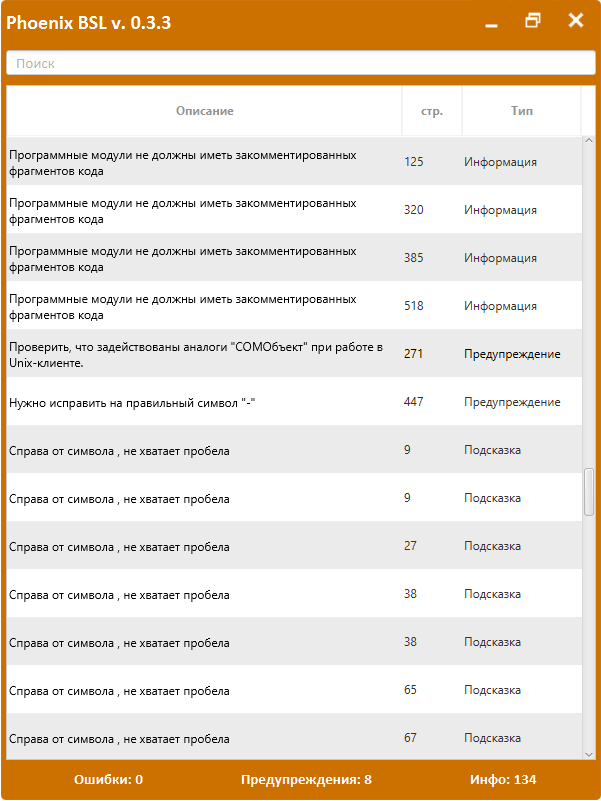

1. Доработки должны соответствовать регламенту разработки

2. При наличии **БПР** новый функционал должен по максиму использоваться ее функционал

3. Проверить свой код с помощью **[Phoenix Bsl](https://otymko.github.io/phoenixbsl/)**.

    

Файл с настройками: **[settingsBSL.json ](file/settingsBSL.json)**

