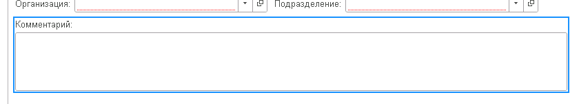
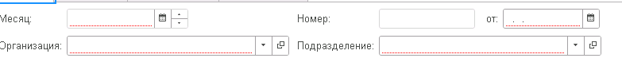

Все доработки типовых форм осуществляются программным способом. Используется функционал **БПР**, подробнее в разделе **[“Программная доработка форм“](../psl/modification_forms.md).**

## Форма объекта

### Общие

1. При разработке команд на форме не забывать про галку **"Изменяет сохраняемые данные"** т.к автоматом не будет взведен флаг **Модифицированность** и при установке форме свойства **ТолькоПросмотр** кнопка останется активной.

2. У страницы с табличной частью должно быть заполнено свойство **ПутьКДаннымЗаголовка** (Объект.Товары.КоличествоСтрок).

3. Стараться проверять на заполнение реквизитов формы через установку свойства **“Проверка заполнения“:**

 

Проверка в коде будет следующим образом:

```
Если Не ПроверитьЗаполнение() Тогда
	Возврат;
КонецЕсли;
```
### Новые объекты

1. Формы объектов должны придерживаться стилистики типовых объектов (пример **ERP**).
2. Для документов следовать стандартам раздела [Формы документов.](https://its.1c.ru/db/v8std#browse:13:-1:7:9)
3. Разделять реквизиты шапки и табличных частей на отдельные вкладки: Основное (реквизиты шапки), Товары (табличная часть товары).
4. [Правила компоновки форм](https://its.1c.ru/db/v8std#content:722:hdoc).

### Типовые объекты
1. Все доработки типовых форм осуществляются программным способом. Используется функционал **БПР**, подробнее в разделе **[“Программная доработка форм“](../psl/modification_forms.md).**
2. Если на форме есть страница с вкладками тогда новые реквизиты размещаются на новую вкладку **рздСтраницаСпециальная (Специальная)** при условие, что в ТЗ не прописано явное расположение.
3. Если на форме нет вкладок тогда создается новая служебная группа **рздГруппаСпециальная** без заголовка и выделений. Внутри новой группы уже размещаются новые элементы. При условие, что в ТЗ не прописано явное расположение.

### Рекомендуемые свойства элементов

* Поле **Комментарий** (многострочный): Ширина 79, Высота 3, Растягивать по горизонтали и вертикали Нет.


* **Ссылочные поля**: МаксимальнаяШирина 27


## Форма списка

1. [Реквизит Ссылка и признак "Использовать всегда" в динамических списках объектов](https://its.1c.ru/db/v8std/content/702/hdoc)