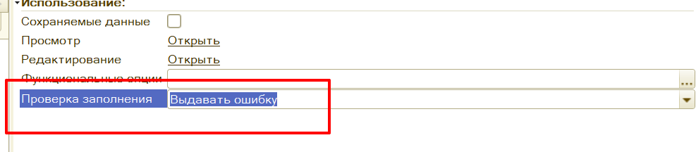

Все доработки типовых форм осуществляются программным способом. Используется функционал **БПР**, подробнее в разделе **[“Программная доработка форм“](../psl/modification_forms.md).**

1. Если на форме есть страница с вкладками тогда новые реквизиты размещаются на новую вкладку **рздСтраницаСпециальная (Специальная)** при условие, что в ТЗ не прописано явное расположение.

2. Если на форме нет вкладок тогда создается новая служебная группа **рздГруппаСпециальная** без заголовка и выделений. Внутри новой группы уже размещаются новые элементы. При условие, что в ТЗ не прописано явное расположение.

3. При разработке команд на форме не забывать про галку **"Изменяет сохраняемые данные"** т.к автоматом не будет взведен флаг **Модифицированность** и при установке форме свойства **ТолькоПросмотр** кнопка останется активной.

4. Стараться проверять на заполнение реквизитов формы через установку свойства **“Проверка заполнения“:**

 

Проверка в коде будет следующим образом:

```
Если Не ПроверитьЗаполнение() Тогда
	Возврат;
КонецЕсли;
```