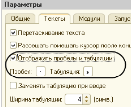

## Модули

Все модули (общие, формы, объекта, менеджера, команд) должны соответствовать стандартам:

* [Структура модуля](https://its.1c.ru/db/v8std/content/455/hdoc)

* [Поддержка толстого клиента, управляемое приложение, клиент-сервер](https://its.1c.ru/db/v8std/content/680/hdoc) (относится к модулю объекта и менеджера)

* В доработанных типовых объектах наш код должен быть расположен в собственной области в низу модуля:

  ```
  #Область Раздолье
  
  // Твой код
  
  #КонецОбласти
  ```

## Строки

1. При длине строки более **140** символов следует использовать переносы. Строки длиннее **140** символов делать не рекомендуется, за исключением тех случаев, когда перенос невозможен (например, в коде определена длинная строковая константа, которая выводится без переносов в окно сообщений с помощью объекта СообщениеПользователю).

2. [Конкатенация строк может быть заменена на СтрСоединить или СтрШаблон](https://docs.checkbsl.org/checks/overall/StringConcat/)

    Вместо:

    ```
    Процедура ВыводОшибки(НомерСтроки, ТипДанных)
	    Результат = "Ошибка в данных в строке " + НомерСтроки + " (требуется тип " + ТипДанных + ")";
    КонецПроцедуры
    ```

    Использовать:

    ```
    Процедура ВыводОшибки(НомерСтроки, ТипДанных)
	    Результат = СтрШаблон("Ошибка в данных в строке %1 (требуется тип %2)", НомерСтроки, ТипДанных);
    КонецПроцедуры
    ```

## Имена методов и их описание

1. Стандарт 1С [“Описание процедур и функций“](https://its.1c.ru/db/v8std/content/453/hdoc)

2. Стандарт 1C “[Правила образования имен переменных](https://its.1c.ru/db/v8std/content/454/hdoc)“
   
   **Важно**: Не использовать сокращения переменных подобных примеру:
    
     

3. [Все методы программного интерфейса должны иметь описание](https://1c-syntax.github.io/bsl-language-server/diagnostics/PublicMethodsDescription/). 

Это единственный “контракт” между разработчиками касающихся типизации. Для быстрого создания описания есть специальная возможность в конфигураторе (После создания описание нужно убрать начальную часть **Процедура / Функция)**:


4. [Имя функции не должно начинаться с "Получить"](https://1c-syntax.github.io/bsl-language-server/diagnostics/FunctionNameStartsWithGet/)

5. [Правильный выбор имен процедур и функций очень важен для повышения читаемости кода](https://its.1c.ru/db/v8std/content/647/hdoc)

## Запросы

1. [Оформление текстов запросов](https://its.1c.ru/db/v8std/content/437/hdoc)

2. Нужно стараться, чтобы каждая часть формируемого запроса могла быть открыта с помощью конструктора запросов

## Читаемость кода

### Избыточный верхний уровень условия Если...Тогда...Иначе

Для улучшения читаемости сделать условие в начале метода с выходом из метода с помощью Возврат.

### Необязательный комментарий

Оставляйте комментарий который имеет смысл и может помочь другим разработчикам.

### Присутствует «мертвый» код, пустой обработчик

Не должно быть закомментированного кода и пустых обработчиков.

### Проверка заполненности/пустоты коллекции

Для повышения читаемости проверку коллекции на заполненность/пустоту лучше выполнять через специальную функцию **ЗначениеЗаполнено** вместо использования сравнения количества коллекцию с нулем. [Правило](https://docs.checkbsl.org/checks/overall/FullEmptyCollection/)

### Разделение на логические сегменты

Пустые строки помогают разбивать код приложения на логические сегменты. Одной пустой строкой отделяются друг от друга методы и логические секции внутри метода для более удобного чтения.

### Разделить выполнение и выборку/выгрузку результата запроса

Правильно разделять выполнение и выборку/выгрузку результата запроса.

### Тексты запросов выносите в отдельные функции

Длинные запросы, больше обычной выборки с условием, стоит выносить в отдельную функцию. Код становится компактней, а для отладки текста запроса код модуля не нужен.

## Непечатные символы

Обязательно включить отображение непечатных символов. [ИТС: Отобразить непечатаемые символы](https://its.1c.ru/db/pub101advice/content/12/hdoc)



Выравнивание по символам делается с помощью пробелов. Нельзя использовать табы после первого значимого символа. В разных средах будет разъезжаться отображение. 

Для облегчения рутины можно использовать инструмент для выравнивания [ones-formatting](https://github.com/leobrn/ones-formatting). 

[Статья: Отступ с помощью табуляции, выравнивание по пробелам](https://dmitryfrank.com/articles/indent_with_tabs_align_with_spaces).
