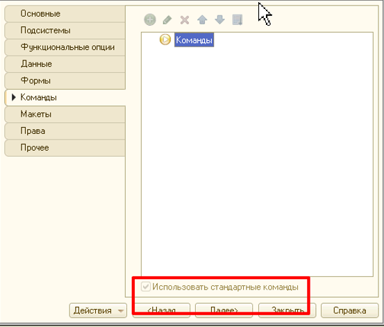

## Основное

1. Отчеты должны быть подключены к подсистеме **БСП “Варианты отчетов”.**

    Как правило это в модуле **рздМодификацияКонфигурацииСервер** *(убедиться, что модуль указан в ВариантыОтчетовПереопределяемый.НастроитьВариантыОтчетов)***:**

   ```
   рздМодификацияКонфигурацииСервер.НастроитьВариантыОтчетов
   ```

2. Настройки отчета прописываются в модуле менеджера согласно документации **БСП**.

3. После подключения у отчета нужно убрать использование стандартных команд:

    

4. Не оставлять имя варианта отчета **Основной**.

5. Новый объект должен быть размещен в служебную подсистему согласно регламенту “[Подсистемы](subsystem.md)“.

6. *Не забыть поднять версию после подключения отчета в **рздОбновлениеИнформационнойБазы.ПриДобавленииПодсистемы.***

7. Для отчета должна быть создана роль **рздПросмотрОтчета\<ИмяОтчета\>** согласно регламенту [Роли](roles.md).

## Кадровые данные в отчетах

При работе с кадровыми данными в отчетах в типовых конфигурациях нужно использовать механизм представлений:

1. [Статья: Введение в механизм представлений в ЗУП ред. 3](https://infostart.ru/1c/articles/841337/)

2. **[Файл: Пример отчета](file/testpredstavlenija.erf)**
