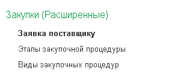

1. Все новые объекты должны быть добавлены в служебную подсистему. Подробнее в разделе [“Начало разработки“.](../begin.md)

2. Создаем новые подсистемы для пользователей только на втором уровне, типовые подсистемы не меняем. Правила наименования следующие:
   **рзд\<ИмяРодительскойПодсистемы\> (Расширенное)**

   Примеры:

   * Продажи (Расширенные)

   * Производство (Расширенное)

   

   Справочники располагаем вверху, потом документы. Также можно какие-то объекты выделить через "**Важное**".

   **Исключения**. Если по вашему функционалу новых объектов от 3 и более то можно обособить в отдельную подсистему с собственным наименование или аналогичным наименованием типового подраздела, но с допиской расширения. Например, в подсистеме Склад добавляем  **"Обеспечение потребностей (Расширенное)".**

   Также важно не забывать, что на подсистемы нужно выдавать роль т.к на подчиненные подсистемы не распространяется доступность основной.  **рздПодсистема\<ИмяПодсистемы\>** (имя подсистемы уже без рзд).