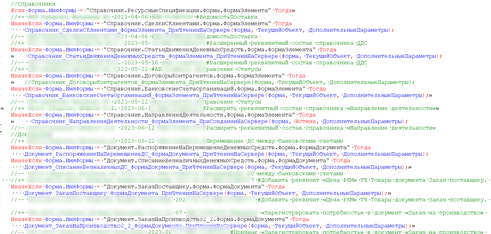

1. Каждый добавляемый объект метаданных должен содержать в своем наименовании префикс **рзд**:

    ```
    // Шаблон
    рзд<Наименование>

    // Примеры
    рздСотрудникиСервер
    рздСлужебныеНастройки
    ```

2. Синоним метаданных не должен содержать наш префикс.  Если нужно, чтобы новый объект отличался от типового т.к используется один и тот же синоним то используйте в конце наименования **(Расширенный).**

    ```
    Товары на складах (Расширенный)
    ```

    Допускается использование в синониме **(Раздолье)** при заполненных полях представление и расширенное представление тогда будет удобно искать объект во всех функциях по строке **Раздолье** и при этом пользователей не будет отвлекать ненужная часть наименования. Также допускается использование в синониме **(Раздолье)** в ролях и регламентных заданиях для удобной настройки системы.

3. При добавлении нового объекта в обязательном порядке требуется указать в комментарии причину добавления:

    ```
    // рзд Очаковский В.М 06.03.2024 ФР-КУ-1
    ```

4. Комментарий в коде типовых модулей должен иметь следующий вид:

    ```
    // рзд Очаковский В.М 10.03.2024 ФР-КУ-1 {

	// Ваш код

    // }рзд Очаковский В.М 10.03.2024
    ```

    Шаблон начала комментарий:

    ```
    // рзд Очаковский В.М <?"", ДатаВремя, "ДФ=dd.MM.yyyy"> <?"Номер задачи"> {
    <?>
    ```

    Шаблон окончания комментарий:

    ```
    <?>// }рзд Очаковский В.М <?"", ДатаВремя, "ДФ=dd.MM.yyyy">
    ```

**[Раздолье.st](file/razdole.st)**


Комментарии (об изменении с фамилией и датой) в модулях и методах с префиксом **рзд** не оставляются (актуально при использование систем контроля версий). Также не нужно оборачивать новые методы **рзд** комментарием в начале и в конце. 

<details>
  <summary>Почему это важно?</summary>



**Снижается читаемости кода**

Большое количество таких комментариев, особенно в относительно небольших методах, процедурах или функциях, действительно может значительно затруднить чтение и понимание самого кода.

**Избыточность информации**

Современные системы контроля версий, уже отслеживают изменения в коде с указанием автора и даты. Дублирование этой информации в виде комментариев в самом коде избыточно.

**Быстрое устаревание информации**

При активной разработке код может меняться несколько раз в день разными разработчиками. В этом случае комментарии с фамилиями и датами очень быстро устареют и потеряют актуальность.

**Нарушение принципов чистого кода**

Современные методологии разработки, такие как принципы чистого кода, рекомендуют избегать излишних комментариев и стремиться к написанию самодокументируемого кода за счет осмысленных имен переменных, методов и т.д.

**Отвлечение внимания**

Большое количество таких комментариев может отвлекать внимание разработчика от самой логики кода при чтении и изучении программы.

</details>