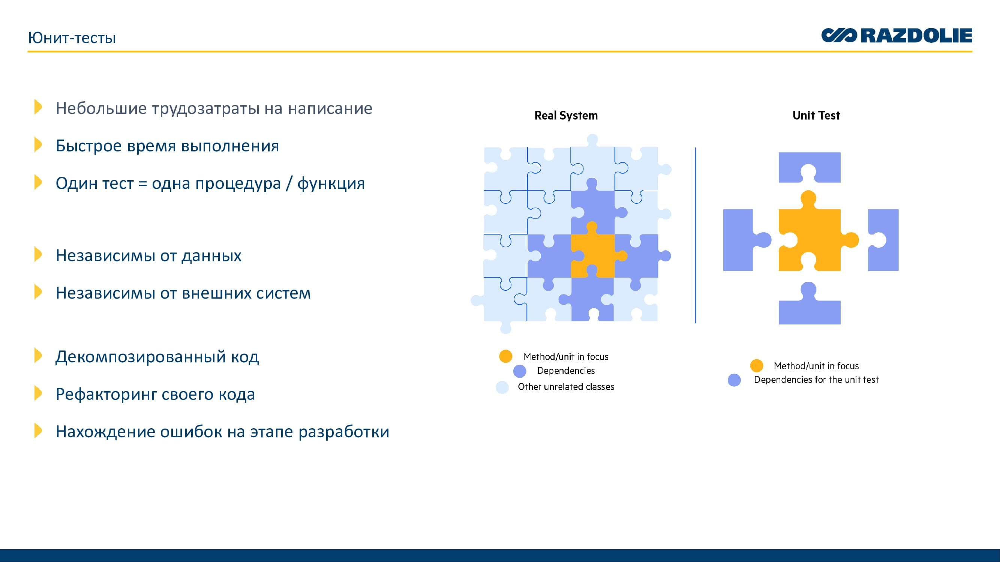

### **Юнит и дымовые тесты**

Прежде чем углубиться в юнит-тесты, начнем с рассмотрения дымовых тестов, чтобы лучше понять различия между этими подходами.

---

### **Дымовые тесты**

Дымовые тесты — это быстрые проверки на наличие явных ошибок, которые оценивают стабильность системы в целом. Эти тесты отвечают на вопрос: *"Работает ли приложение в целом?"*

Примеры в 1С:
- Открытие форм
- Проведение документов
- Проверка макетов СКД
- Формирование печатных форм

**Происхождение термина:**
Название пришло из электротехники. Когда оборудование впервые подключали к сети, его могли проверить на наличие дефектов — если появлялся дым, сборку откатывали назад.

---

### **Юнит-тесты**

**Ключевые характеристики:**
- Низкие трудозатраты на написание
- Быстрое выполнение
- Каждый тест проверяет одну функцию или процедуру
- В отличие от дымовых тестов, важен не только результат (например, форма открылась), но и корректность работы логики

**Обычно юнит-тесты:**
- Независимы от данных
- Независимы от внешних систем

**Преимущества для разработчика:**
- Улучшение структуры кода (разделение обязанностей между модулями)
- Рефакторинг кода (тестирование стимулирует улучшение структуры)
- Обнаружение ошибок на ранних этапах

---

### **Пирамида тестов**

Изображение пирамиды тестирования демонстрирует уровни сложности в создании тестов.

1. **Модульное тестирование (Unit Testing)** — самый низкий уровень, прост в реализации.
2. **Интеграционное и системное тестирование** — проверка взаимодействия между модулями и всей системой в целом.
3. **Тестирование взаимодействий между системами** — самый сложный и финальный этап.

Дымовые тесты находятся вне этой схемы, так как они уже готовые и не требуют постоянного написания. Чем выше по пирамиде — тем сложнее создавать тесты.

---

### **Исключения и проверки**

Юнит-тесты помогают обнаружить непредвиденные исключения, чего не хватает в дымовых тестах. 

Пример метафоры с броней:
- Дымовые тесты — это базовый уровень защиты.
- Юнит-тесты — добавляют проверку корректности работы функций.
- Сценарные тесты — проверяют взаимодействие различных компонентов системы и бизнес-логику.

---

### **Писать тесты долго?**

Некоторые считают, что тесты отнимают много времени. Рассмотрим классический процесс доработки документа:
1. Написание кода
2. Запуск системы
3. Открытие документа, проведение и проверка результата...

Это занимает много итераций и времени.

**Решение:** Мы идем от простого к сложному, тестируя программный интерфейс. Если написание тестов затруднительно, это может указывать на необходимость рефакторинга кода или слишком высокую связанность модулей.

---

### **Инструментарий**

Для тестирования в 1С есть два основных инструмента:
- **Vanessa ADD** (внешние обработки)
- **YaXunit** (расширение)

---

### **Пример простых тестов**

На примере сложения двух чисел:
- Мы вызываем экспортную функцию и проверяем её результат. Нам не обязательно проверять каждый результат до мелочей — можно проверить тип и заполненность.

---

### **Обход зависимостей при тестировании**

Иногда методы содержат зависимости от внешних объектов или систем, что усложняет тестирование. Чтобы это обойти, можно делать подмену объектов. 

Например:
- Подмена объекта **HTTPСоединение** при тестировании взаимодействия с внешними сервисами. Это позволяет тестировать логику без реального подключения.

---

### **Генерация тестовых данных**

Данные для тестов могут быть:
- Созданы в самом тесте
- Вынесены в отдельный модуль или плагин

**Пример кода:** вызов метода создания новых данных: `ТестовыеДанные.НоваяНоменклатура(Реквизиты)`

Тесты можно запускать в транзакции для автоматического отката изменений после теста.

---

### **Покрытие кода тестами**

Покрытие кода — это метрика, которая показывает, какая часть исходного кода выполнялась во время тестов.

Инструмент для контроля покрытия — **SonarQube**. Он позволяет увидеть, какие строки кода были протестированы, а какие — нет.

---

### **Результаты тестов**

Юнит-тесты действительно работают! На примере проекта **[Ревьювер](https://infostart.ru/profile/350139/)** видно, что при покрытии в 44% (без учета объектов БСП) система уже более устойчива к изменениям. Однако для более полной защиты необходимы сценарные тесты. 

Благодаря юнит-тестам я могу смело вносить изменения и рефакторить код, не опасаясь появления новых ошибок.

---

### **Материалы**
1. [Быстрый старт в тестировании на платформе 1С (Vanessa-ADD)](https://infostart.ru/1c/articles/1801764/])
2. [В чём разница Smoke, Sanity, Regression, Re-test и как их различать?](https://habr.com/ru/articles/358142/)
3. [YAxUnit или модульное тестирование в 1С](https://infostart.ru/1c/articles/1976659/)